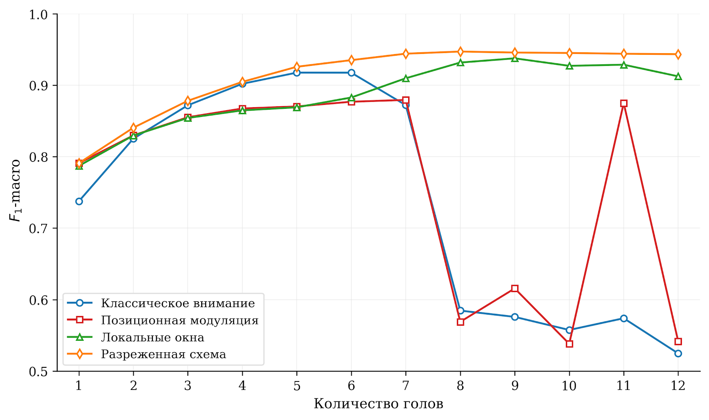
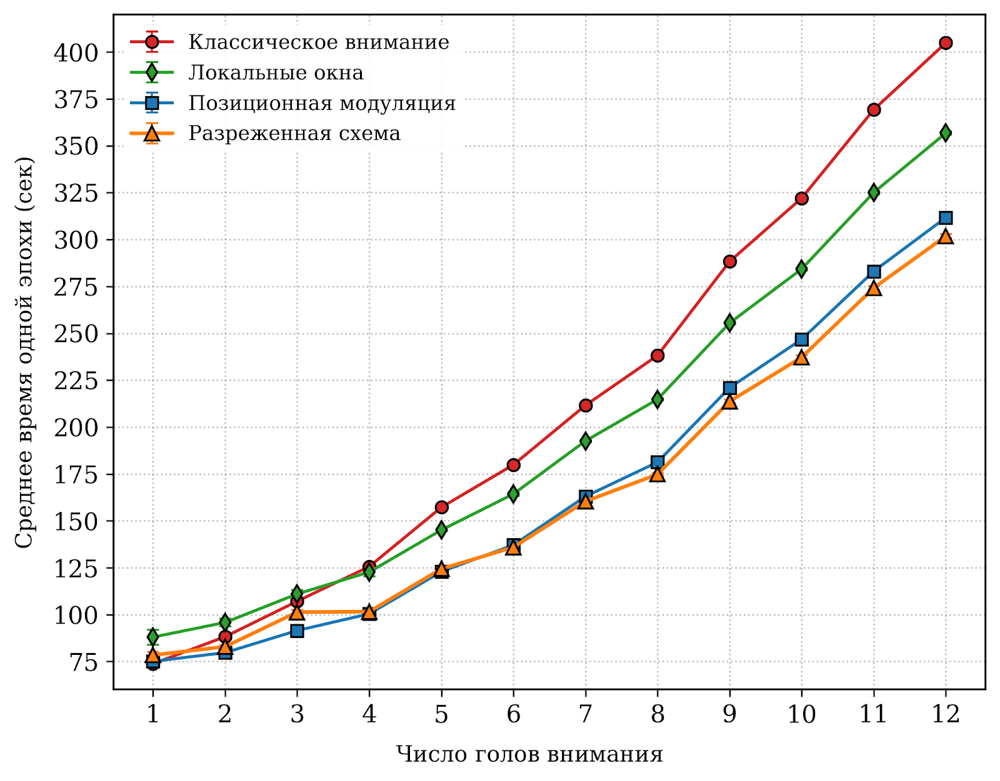

# Linearized Attention for BERT

Исследовательская реализация BERT-подобной модели с заменой классического `self-attention` на семейство линеаризованных механизмов внимания. Проект построен вокруг идеи: **формировать контекст через прямую агрегацию векторов `Value`, не вычисляя матрицы `Query × Keyᵀ`**.

Работа включает реализацию кастомных attention-блоков, интеграцию в BERT, синтетические контрольные задачи и основной эксперимент на классификации отзывов Amazon Reviews'23.

## Что сделано

- Реализована базовая схема линейной агрегации контекста без построения `QKᵀ`.
- Добавлена позиционная модуляция `Value` с обучаемым коэффициентом для каждой головы.
- Реализована разреженная схема внимания с разными шагами и смещениями по головам.
- Реализован механизм локальных окон с несколькими масштабами контекста.
- Модифицированные attention-блоки интегрированы в BERT-подобную архитектуру.
- Проведено сравнение с классическим `self-attention` по качеству, времени обучения и VRAM.

## Ключевой результат

В основном эксперименте на Amazon Reviews'23 наиболее сбалансированный результат показала **разреженная схема внимания**:

| Конфигурация | F1-macro | F1-weighted | VRAM | Среднее время эпохи |
|---|---:|---:|---:|---:|
| Разреженная схема, `H = 6` | **0.9350** | **0.9455** | **4071 МБ** | **−24.5%** к классическому attention |

Разреженная агрегация сохраняет качество классификации и снижает время обучения при сопоставимом потреблении видеопамяти.

## Идея метода

Классический `self-attention` строит матрицу попарных сходств между всеми токенами:

```text
Attention(Q, K, V) = softmax(QKᵀ / sqrt(d))V
```

Это дает выразительный механизм контекста, но требует построения матрицы размера `n × n`, где `n` — длина последовательности. При росте `n` вычислительная сложность становится квадратичной.

В этом проекте используется другой принцип: вместо поиска попарных сходств контекст строится через агрегацию векторов `Value`. Для токена `i` базовая схема усредняет значения остальных непаддинговых токенов:

```text
A_i = (sum_j V_j * m_j - V_i * m_i) / (sum_j m_j - 1)
```

где `V_j` — value-вектор токена, `m_j` — маска допустимого токена. Такой блок не использует `Query`, `Key` и не строит `QKᵀ`, но базовая агрегация теряет часть позиционной и структурной информации. Поэтому поверх нее реализованы три модификации.

## Реализованные механизмы внимания

### 1. Базовая линейная агрегация — `base`

Простейший вариант линейного контекста. Для каждого токена формируется усредненное представление остальных токенов последовательности. Паддинг исключается через attention mask.

Особенности:

- не строит `QKᵀ`;
- не использует `Query` и `Key`;
- работает только через `Value`;
- служит базовой точкой для последующих модификаций.

### 2. Позиционная модуляция — `pos-enc`

Позиционный сигнал добавляется не к входному эмбеддингу, а непосредственно к value-представлению. Для каждой головы внимания вводится обучаемый коэффициент `s_h`, который регулирует силу позиционной поправки:

```text
V'_{h,i} = V_{h,i} * (1 + s_h * PE_i)
```

Так разные головы могут по-разному учитывать порядок токенов: одни почти сохраняют глобальное усреднение, другие сильнее зависят от позиции. Это компенсирует сглаживание, возникающее при простой линейной агрегации.

### 3. Разреженная схема — `dilated`

Контекст строится не по всей последовательности, а по разреженной сетке позиций. Для каждой головы задаются:

- `d_h` — шаг разреженности;
- `o_h` — смещение начальной позиции.

```text
I_h = { i | (i - o_h) mod d_h = 0 }
```

Одна голова может учитывать каждый токен, другая — каждый второй, следующая — каждый четвертый. Смещения дают разное покрытие позиций, включая четные и нечетные токены. В результате головы извлекают контекст разных масштабов без полной матрицы внимания.

### 4. Локальные окна — `local-window`

Контекст формируется по непрерывной окрестности токена. Ширина окна задается отдельно для каждой головы и постепенно уменьшается: первые головы работают с широким контекстом, последующие — с более узкими локальными фрагментами.

На краях последовательности окно сдвигается внутрь допустимого диапазона. Для ускорения агрегации используются префиксные суммы, поэтому сумма по окну вычисляется без явного перебора всех токенов внутри окна.

## Методология экспериментов

Проверка выполнялась в несколько этапов:

1. **Синтетическая задача positional lookup** — проверка учета позиционной информации.
2. **Синтетическая задача consecutive ones** — проверка способности выделять локальные зависимости.
3. **Основной эксперимент на Amazon Reviews'23** — классификация отзывов с изменением числа голов внимания.
4. **Дополнительная проверка по длинам отзывов** — анализ качества на разных диапазонах длины входной последовательности.

В основном эксперименте использовались домены:

- `All Beauty`;
- `Electronics`;
- `Movies`.

Размер каждой подвыборки — **225 000 отзывов**. Число голов внимания `H` изменялось, а размерность одной головы фиксировалась на уровне **64**. Эксперименты проводились на **NVIDIA DGX, Tesla V100 16 GB, FP16**.

Сравнение выполнялось по трем группам метрик:

- качество классификации: `F1-macro`, `F1-weighted`, `Accuracy`;
- вычислительные затраты: среднее время эпохи, время инференса;
- память: пиковое потребление `VRAM`.

## Результаты

### Качество классификации при `H = 6`

| Механизм внимания | F1-macro | F1-weighted |
|---|---:|---:|
| Классическое внимание | 0.9174 | 0.9287 |
| Позиционная модуляция | 0.8768 | 0.9056 |
| **Разреженная схема** | **0.9350** | **0.9455** |
| Локальные окна | 0.8827 | 0.9076 |

При `H = 6` разреженная схема показала лучший результат по обеим F1-метрикам. При `H ≥ 8` у классического внимания наблюдается резкий провал `F1-macro` вплоть до `0.5247`, тогда как разреженная схема держится около `0.94`, а локальные окна — в диапазоне около `0.90–0.93`.



### Время обучения

Разреженная схема дает максимальный выигрыш по среднему времени эпохи. Выигрыш усиливается при увеличении числа голов внимания:

| Конфигурация | Выигрыш по времени эпохи |
|---|---:|
| Разреженная схема, `H = 6` | −24.5% |
| Разреженная схема, `H = 12` | −25.5% |
| Локальные окна, `H = 12` | −11.9% |



### Потребление VRAM

| Механизм внимания | H=1 | H=2 | H=4 | H=6 | H=8 | H=12 |
|---|---:|---:|---:|---:|---:|---:|
| Классическое внимание | 1061 | 1657 | 2883 | 4142 | 5401 | 8016 |
| Позиционная модуляция | 762 | 1347 | 2549 | 3782 | 5019 | 7580 |
| Разреженная схема | 812 | 1444 | 2742 | 4071 | 5405 | 8156 |
| Локальные окна | 810 | 1445 | 2744 | 4079 | 5412 | 8167 |

При `H = 6` разреженная схема использует **4071 МБ** против **4142 МБ** у классического attention. При `H = 12` потребление остается сопоставимым: **8156 МБ** против **8016 МБ**.

### Проверка по длинам последовательностей

| Длина, токенов | Кол-во отзывов | Классическое, H=5 | PosEnc, H=6 | Local Window, H=8 | Dilated, H=6 |
|---:|---:|---:|---:|---:|---:|
| 0–128 | 20 862 | 0.9100 | 0.8665 | 0.9249 | **0.9290** |
| 128–256 | 1 225 | 0.9950 | 0.9865 | **0.9974** | 0.9954 |
| 256–384 | 255 | **1.0000** | 0.9947 | **1.0000** | 0.9973 |
| Все | 22 500 | 0.9163 | 0.8754 | 0.9302 | **0.9339** |

Основная часть тестовой выборки — **92.7%** отзывов — находится в диапазоне `0–128` токенов. На этой группе разреженная схема дает `F1-macro = 0.9290` против `0.9100` у классического внимания.

## Структура проекта

```text
.
├── custom_attention.py          # кастомные attention-блоки и интеграция в BERT
├── main.py                      # верхнеуровневый CLI
├── config.json                  # конфигурации текстовых экспериментов
├── dataset_utils.py             # подготовка train/val/test и датасет отзывов
├── logging_utils.py             # логирование и сохранение результатов
├── synthetic/
│   ├── dataset.py               # positional lookup dataset
│   ├── consecutive_ones_dataset.py
│   ├── model.py                 # synthetic-модели и фабрики
│   ├── train_positional.py
│   └── train_consecutive_ones.py
└── training/
    ├── callbacks.py             # Trainer callbacks и custom trainer
    ├── config.py                # загрузка и типизация конфигов
    ├── cv.py                    # cross-validation
    ├── eval.py                  # оценка на length bins и сохранение метрик
    ├── model_factory.py         # фабрики моделей и attention-реестры
    ├── pipeline.py              # основной train/eval pipeline для отзывов
    ├── synthetic_pipeline.py
    ├── consecutive_ones_pipeline.py
    └── schemas.py               # dataclass-схемы конфигов и артефактов
```

## Установка

Минимальные зависимости:

- Python 3.11+
- PyTorch
- Transformers
- scikit-learn
- pandas

```bash
pip install torch transformers scikit-learn pandas
```

При использовании GPU установите версию PyTorch под свою CUDA-конфигурацию.

## Быстрый старт

### 1. Подготовьте данные

Для текстового сценария нужен CSV-файл с отзывами. Если в проекте еще нет папки `datasets/` с готовыми `train/val/test`, код попытается собрать их из исходного CSV.

Пример расположения файла:

```text
datasets/amazon2023_225.csv
```

Конфигурация эксперимента задается в `config.json`, например `amazon_5class`.

### 2. Классический BERT

Классический BERT запускается без замены attention-слоев:

```bash
python main.py reviews \
  --train datasets/amazon2023_225.csv \
  --output results_original.csv \
  --log train_original.log \
  --replace 0 \
  --add 0 \
  --remove 0 \
  --config-file config.json \
  --config-name amazon_5class
```

### 3. Позиционная модуляция

```bash
python main.py reviews \
  --train datasets/amazon2023_225.csv \
  --output results_posenc.csv \
  --log train_posenc.log \
  --replace 4 \
  --add 0 \
  --remove 0 \
  --config-file config.json \
  --config-name amazon_5class \
  --attention-type pos-enc
```

### 4. Разреженная схема

```bash
python main.py reviews \
  --train datasets/amazon2023_225.csv \
  --output results_dilated.csv \
  --log train_dilated.log \
  --replace 4 \
  --add 0 \
  --remove 0 \
  --config-file config.json \
  --config-name amazon_5class \
  --attention-type dilated
```

### 5. Локальные окна

```bash
python main.py reviews \
  --train datasets/amazon2023_225.csv \
  --output results_local_window.csv \
  --log train_local_window.log \
  --replace 4 \
  --add 0 \
  --remove 0 \
  --config-file config.json \
  --config-name amazon_5class \
  --attention-type local-window
```

### 6. Кросс-валидация

```bash
python main.py reviews \
  --train datasets/amazon2023_225.csv \
  --output results_cv3_local_window.csv \
  --log train_cv3_local_window.log \
  --replace 4 \
  --add 0 \
  --remove 0 \
  --config-file config.json \
  --config-name amazon_5class \
  --attention-type local-window \
  --n-folds 3
```

После запуска:

- подробный лог сохраняется в `logs/...`;
- итоговые метрики сохраняются в CSV, указанный через `--output`;
- checkpoint-и сохраняются в директории конкретного запуска.

## Синтетические задачи

### Positional Lookup

Задача проверяет, умеет ли модель использовать позиционную информацию относительно фиксированного маркера.

```bash
python main.py synthetic \
  --mode single \
  --attention_type pos-enc \
  --vocab_size 10 \
  --k 4 \
  --hidden_size 96 \
  --num_heads 4 \
  --num_layers 2
```

### Consecutive Ones

Задача проверяет способность модели выделять локальную структуру: максимальную длину подряд идущих единиц в бинарной последовательности.

```bash
python main.py synthetic-consecutive-ones \
  --mode single \
  --attention_type local-window \
  --context_len 64 \
  --hidden_size 96 \
  --num_heads 4 \
  --num_layers 2
```

## Где смотреть код

| Файл | Назначение |
|---|---|
| `custom_attention.py` | реализации `base`, `pos-enc`, `dilated`, `local-window`, `weighted` и интеграция в BERT |
| `training/model_factory.py` | создание моделей и выбор типа внимания |
| `training/pipeline.py` | основной сценарий обучения на отзывах |
| `training/eval.py` | оценка на length bins и сохранение метрик |
| `synthetic/model.py` | синтетические модели и pooling-логика |
| `training/schemas.py` | dataclass-схемы конфигов и артефактов |

## Проверка качества кода

```bash
python -m py_compile main.py custom_attention.py
python -m pytest
ruff check .
black .
```

## Итог

Разработанный подход показывает, что полный `self-attention` можно заменить более дешевой агрегацией `Value`, если вернуть модели недостающую структуру через позиционную модуляцию, разреженные сетки и локальные окна. В экспериментах разреженная схема оказалась лучшим компромиссом: она сохраняет качество, снижает время обучения и остается близкой к классическому attention по потреблению VRAM.
